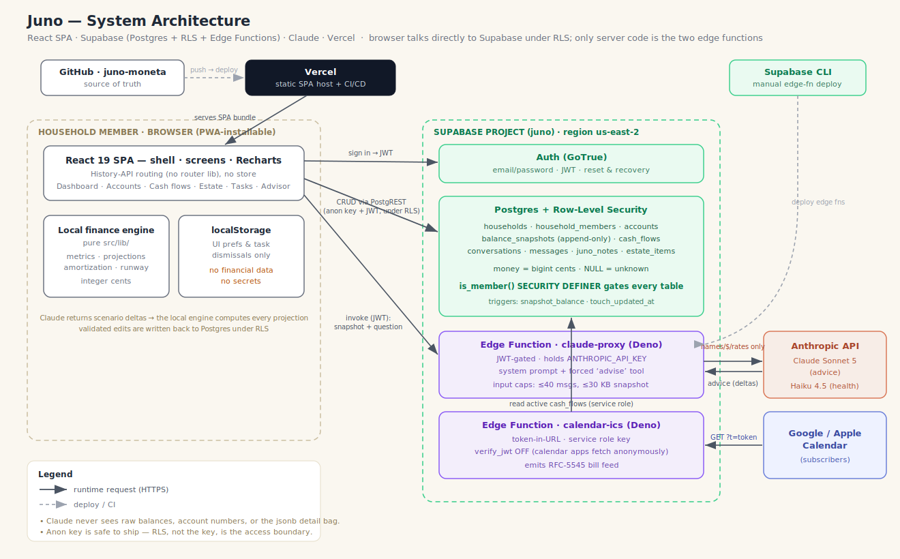

# Juno — Architecture

Juno is a household-finance app: a React SPA that models a family's whole financial
picture (accounts, debts, recurring cash flows, estate documents), computes net worth,
runway, and debt-payoff dates locally, and embeds a Claude-powered advisor that answers
what-if questions against the real numbers. This document describes how the system is
put together. For the *rules* the engine obeys (money as cents, NULL = unknown, additive
migrations, the advisor never does verifiable math), see [`README.md`](../README.md) —
those invariants are law and are not repeated in full here. For the security posture (trust
boundaries, RLS, the LLM/secret boundary, encryption) see [`security.md`](security.md); for
data protection and third parties see [`compliance.md`](compliance.md).

> **Diagram:** [`architecture.svg`](architecture.svg) (view) · [`architecture.drawio`](architecture.drawio) (editable source, open at [draw.io](https://app.diagrams.net)).



## Topology at a glance

| Layer | Technology | Notes |
|---|---|---|
| Frontend | React 19 · TypeScript · Vite 8 · Tailwind v4 · Recharts | Static SPA, no router/store libraries |
| Hosting / CI | Vercel | Auto-deploys on push to `main` (GitHub `andrewbaldock/juno-moneta`) |
| Data + Auth | Supabase Postgres · GoTrue auth | Row-Level Security on every table; email/password |
| Server code | 2 Supabase Edge Functions (Deno) | `claude-proxy` (the advisor), `calendar-ics` (ICS feed) |
| LLM | Anthropic Claude | Sonnet 5 (advice), Haiku 4.5 (health probe); key held only in the edge function |
| Dev tooling | Bun · local stdio MCP server (`mcp/server.ts`) | `bun test` gates deploys |

**There is no application backend of our own.** The browser talks directly to Supabase
under RLS with the *publishable* (anon) key; the only server code is the two edge
functions. Juno has **no Fly component** — that belongs to a different project.

## Frontend

### Shell & routing
The app is a single `App.tsx` with a hand-rolled router over the History API — no router
library. `TAB_PATHS` maps tabs to URLs (`/`, `/assets`, `/payments`, `/tasks`, `/estate`,
`/help`); `setTab` calls `history.pushState`, and a `popstate` listener syncs state back.
The URL is the source of truth; the active screen is a ternary in `Shell`. `vercel.json`
rewrites every path to `/index.html` so deep links resolve to the SPA.

The shell is a resizable 3-column layout — past conversations · current conversation ·
workspace — with drag handles, collapse, and dark mode, all persisted to `localStorage`
under `juno.*` keys.

### Screens (`src/screens/`)
Each screen receives `householdId` as a prop and issues **plain `supabase.from(...)`
calls inside `useEffect`.** There is no shared data layer, React Query, context, or store.

| Screen | Reads / writes |
|---|---|
| `Dashboard` | reads `accounts`, `cash_flows`, `balance_snapshots`; writes the do-not-touch **shelf** (`households.shelf_cents`) |
| `Accounts` | CRUD over `accounts` (incl. `details` jsonb per account type) |
| `CashFlows` | CRUD over `cash_flows`; reads liability accounts (pays-down link) + `households.settings` (calendar links) |
| `FlowCalendar` | child of `CashFlows`; pure presentation of bill occurrences; "Share" surfaces the ICS feed URL |
| `Estate` | reads/writes `estate_items` (auto-seeds a checklist) and retitles `accounts.titled_to` |
| `Tasks` | aggregates gaps + checklist + harvested advisor actions + annual law-review nag |
| `Advisor` | the AI advisor: `useAdvisor` hook + conversation UI; the only `claude-proxy` caller |
| `Help` | static in-app reference + design-system page (modal at `/help`) |

### The engine (`src/lib/`)
The financial math is a set of **pure modules** — 10 of 11 files do no I/O (only
`supabase.ts` does). This is what lets the advisor stay honest: Claude proposes *deltas*,
these functions compute every projection.

- `money.ts` — the only cents↔dollars parser/formatter.
- `metrics.ts` — `netWorth`, `liquid`, `monthlyNet`, `project` (month-by-month cash
  projection), `runwayMonths`, `debtOutlooks` (amortization), `netWorthSeries`.
- `advisor.ts` — `buildSnapshot` (the numbers-only picture sent to Claude), `applyScenario`
  (applies Claude's deltas to a copy of the flows), `timelineEvents`, starter `suggestions`.
- `brief.ts` — ranks proactive observations (low runway, income cliffs, payoffs) into the greeting.
- `calendar.ts` — expands flows into dated bill occurrences (duplicated into the `calendar-ics` edge function; kept in sync deliberately).
- `estate.ts` — trust-funding logic (`unfundedAssets`, `trustUnfunded`); pure constants, no I/O.
- `law.ts` — **hand-verified** federal/California/Contra-Costa tax & legal constants, each tagged
  `effectiveDate` + `source`, gated by a `LAW_REVIEWED` stamp. Nothing is scraped or polled.
- `tasks.ts` — derives the task list (gaps, checklist, advisor actions, annual review).
- `edits.ts` — validates/resolves the advisor's proposed ledger edits (names→ids, dollars→cents, add/update only).
- `types.ts` — shared types + category/label constants.

Every pure module ships with a `bun test` file; there are 9 test files, one per module.

### State & household scoping
State is component-local `useState` hydrated by Supabase calls. The closest thing to a
shared model is the `useAdvisor` hook (instantiated once in the shell). **Household scoping
is done by RLS, not by client filters:** `Home` runs
`supabase.from('households').select(...).limit(1).single()` with *no* explicit filter —
RLS restricts the result to the household the user is a member of. `householdId` then flows
to every screen as a prop. Anything household-specific (member display names, advisor tone)
lives in `households.settings` (jsonb), never in code.

### Persona system
"Juno" the advisor is a presentation layer: `brand.ts` (the display name, injected into
`index.html` at build), `copy/juno.ts` (every string she says, parameterized by member),
and `components/juno/` (`JunoPresence` coin + temple-garden motif, `JunoSays` chat bubble,
`motifs.tsx` SVG assets). No real person is ever hardcoded.

### PWA
Installable via `public/manifest.webmanifest` (standalone display, 192/512 icons) — but
there is **no service worker and no offline cache.** The "new version available" mechanism
is not a SW: `vite.config.ts` stamps a `buildId` into both the bundle (`__BUILD_ID__`) and
an emitted `version.json`; `UpdateToast` polls `/version.json` every 5 min and offers a
reload when the deployed build differs. `HealthToast` similarly polls DB + advisor health.

## Data model (Supabase Postgres)

Source of truth is [`supabase/migrations/`](../supabase/migrations) (additive only —
new tables or nullable/defaulted columns, never rename/drop/retype). Money is `bigint`
cents; `NULL` means unknown.

```
auth.users ──< household_members >── households ──┬─ accounts ──< balance_snapshots
   (GoTrue)                          shelf_cents   │   (assets/liabilities,           (append-only,
                                     settings jsonb│    balance_cents, titled_to,      trigger-written)
                                                   │    details jsonb)
                                                   ├─ cash_flows (income/expense, cadence,
                                                   │   account_id → pays down a debt, due-date fields)
                                                   ├─ conversations ──< messages (payload jsonb)
                                                   ├─ juno_notes  (advisor durable memory)
                                                   └─ estate_items (docs checklist + trust funding)
```

Triggers: `snapshot_balance` writes an append-only `balance_snapshots` row on every balance
change (net-worth-over-time for free); `touch_updated_at` maintains `updated_at`.

### Row-Level Security
RLS is enabled on **every** table. Membership is resolved through a `SECURITY DEFINER`
helper, `is_member(household_id)`, because a self-referencing policy on `household_members`
recurses in Postgres RLS. The pattern per table:

```sql
create policy member_all on accounts for all
  using (is_member(household_id)) with check (is_member(household_id));
```

Child tables (`balance_snapshots`, `messages`) resolve membership through their parent's
`household_id` in a subquery. `households`/`household_members` use direct `auth.uid()`
checks. The net effect: the anon key is safe to ship in the client because **RLS, not the
key, is the access boundary** — a signed-in user can only ever read/write their own
household's rows.

## Server code (Supabase Edge Functions, Deno)

### `claude-proxy` — the advisor
The only place the Anthropic key lives. `verify_jwt` is enabled at deploy, so only
signed-in members can call it. Invoked from `Advisor.tsx` (real advice) and
`HealthToast.tsx` (a Haiku health ping). Per request it:
1. Rejects oversized input (>40 messages, >30 KB snapshot).
2. Builds the system prompt (the advisor persona + hard rules) and appends the household's
   `settings.advisor_overlay` as authoritative context.
3. Calls Claude **Sonnet 5** with a forced single `advise` tool call and ephemeral prompt
   caching on the system block.
4. Returns the tool input as `advice`.

**The advisor loop** is the core design idea:

```
SPA: buildSnapshot(accounts, flows, …)   ← names, amounts & rates in whole DOLLARS, gaps, estate
  → claude-proxy (JWT)  → Anthropic (Sonnet 5, advise tool)
  ← advice { reply, actions?, scenario?, edits?, remember?, structural_gaps? }
SPA: local engine (metrics.ts) recomputes every projection from the scenario deltas
SPA: validated edits (lib/edits) written back to accounts / cash_flows under RLS
```

Claude is trusted with judgment, never arithmetic, and **never sees raw balances or account
numbers** — only names, amounts and rates in whole dollars. See
[`compliance.md`](compliance.md) for exactly what data crosses this boundary.

### `calendar-ics` — the bill feed
Serves an RFC-5545 ICS of every dated bill occurrence (1 month back, 12 ahead), recomputed
on each fetch. **Auth is a secret UUID token in the URL** (`?t=…`) — `verify_jwt` is *off*
because Google/Apple Calendar fetch anonymously. It looks up the household by
`settings.calendar.token`, reads active `cash_flows` with the **service-role** key, and
builds the ICS. Events carry the flow name + amount + due date. Rotating the token
(update `settings.calendar.token`) revokes the old feed.

## Local MCP server (dev only)
`mcp/server.ts` is a stdio MCP server that lets an agent (e.g. Claude Code) read and edit
the ledger under RLS during development — tools like `juno_state`, `juno_add_row`,
`juno_project`, `juno_remember`. Money at the tool boundary is dollars. It is **not** part
of the deployed runtime; registered via a repo-root `.mcp.json`.

## Build & deploy

- **Frontend:** `bun run build` (`tsc -b && vite build`) → static assets. **Vercel
  auto-deploys on every push to `main`** (GitHub-connected since 2026-07-13). Manual
  fallback: `bunx vercel deploy --prod --yes` from the repo root (`~/Code/juno`). Verify a
  deploy via `https://juno.andrewbaldock.com/version.json` (fresh `buildId`).
- **Edge functions:** deploy **separately** with the Supabase CLI + a personal access token
  (`ANTHROPIC_API_KEY` / `SUPABASE_SERVICE_ROLE_KEY` set as function secrets). They do *not*
  ride the Vercel deploy.
- **Migrations:** applied to Supabase; additive only.

## Testing
`bun test` covers the pure engine (money, metrics, advisor, brief, calendar, edits, estate,
law shape-guard, tasks) and the ICS builder. UI and Supabase-touching code are verified by
browser passes and `scripts/smoke.ts`, not mock-heavy unit tests.

## Demo mode (`VITE_DEMO=true`)

The public demo is the **same codebase** differentiated only by an env flag. When
`VITE_DEMO` is set:

- **No Supabase.** `src/lib/demo.ts` holds an in-memory store seeded from a fixture — the
  fully-fictional **Rivera household** (net worth, monthly in/out, and runway all reconcile).
  `src/lib/supabase.ts` wraps the client in a `Proxy`: `.from(table)` returns a tiny
  query-builder shim (`select/insert/update/delete/eq/order/limit/single/not/ilike`, chainable
  + thenable, mutations auto-run so fire-and-forget writes still take effect) over that store.
  Every screen is unchanged. Writes mutate the session copy only; **a reload re-seeds**, so a
  visitor can add/edit/delete freely and nothing shared can be corrupted.
- **Auth bypassed.** `App.tsx` short-circuits the session gate with a synthetic `DEMO_SESSION`
  (no `<Login>`).
- **Outbound neutralized.** The health probe (`functions.invoke('claude-proxy',{health:true})`)
  is answered by a local stub; `settings.calendar` is unset so the ICS/embed surface is inert;
  `/version.json` is same-origin. The **advisor stays live**: `functions.invoke('claude-proxy')`
  passes through to the *ambient* project — in the deployed demo that is a **separate,
  rate-limited demo Supabase project** (its own capped key, `verify_jwt` off, Haiku), never the
  real one. (Against the real project locally it 401s harmlessly.)
- **Guided tour.** `src/components/DemoTour.tsx` — an opt-in/out spotlight tour (self-opens once,
  then a persistent "Take the tour" pill), plus a "Reset demo" control. No tour dependency.

**Owner-gated remainder:** the demo Supabase project + capped Anthropic key (for the live
rate-limited advisor), a `juno-demo` Vercel project on the same repo with `VITE_DEMO=true` +
demo project URL/anon, and DNS for `juno-demo.andrewbaldock.com`.

## Known gaps / roadmap

- **Multi-state law needs the household address.** `law.ts` is currently hardcoded to
  California / Contra-Costa County. Generalizing tax and estate figures to any household
  requires capturing the household's address(es) / state — a new (sensitive) data field.
  *On the roadmap.* This also has a compliance implication (more PII); see
  [`compliance.md`](compliance.md).
- `law.ts` has several 2026 values still `null` (pending the annual review stamped by `LAW_REVIEWED`).
- No offline support (no service worker) — the app requires connectivity.
- One household per user is assumed throughout (`limit(1).single()`); multi-household would
  need an explicit selector.
- The ICS feed is a bearer-token capability URL (see compliance doc for the exposure/rotation model).
